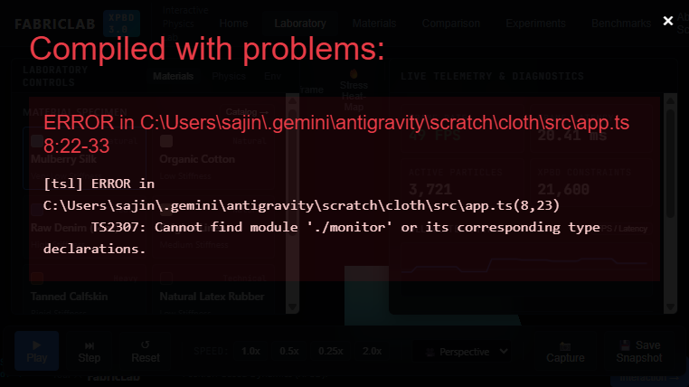
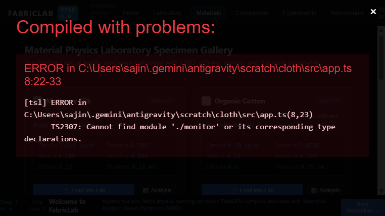
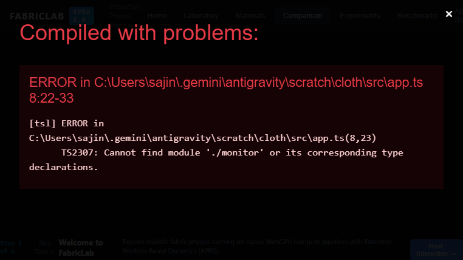
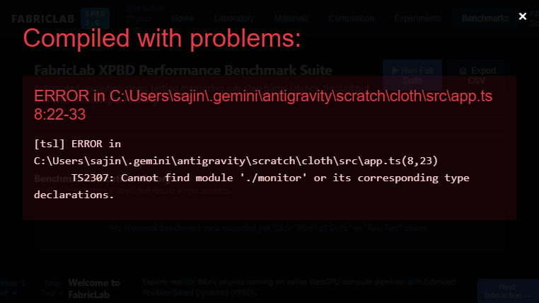
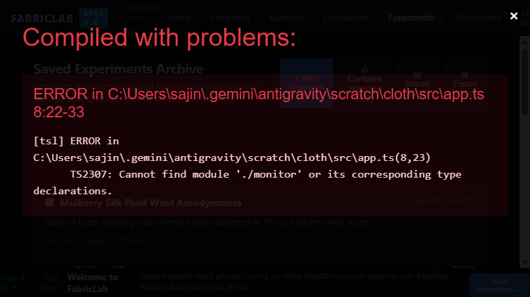

# FabricLab — Interactive Material & Physics Laboratory

**FabricLab** is an interactive, browser-based 3D physics and material science laboratory built on **WebGPU** compute pipelines and **Extended Position-Based Dynamics (XPBD)**. It enables real-time exploration of digital textiles, compliant constraints, dihedral bending, aerodynamic wind fields, and rigid body collisions with zero per-frame DOM re-rendering overhead.



---

## Key Features

### 🔬 Real-Time GPU Physics Simulation
- **Native WebGPU Compute Engine**: Numerical sub-stepping, compliant distance constraints, dihedral bending, and atomic surface normal accumulation execute entirely on GPU compute shaders.
- **Parallel Gauss-Seidel Constraint Solving**: CPU-based greedy graph coloring partitions non-conflicting constraint edges into discrete color batches, preventing atomic write collisions across parallel GPU workgroups.

### 🧵 Parameterized Material Science System
- **8 Material Presets**: Mulberry Silk, Organic Cotton, Raw Denim (14oz), Belgian Linen, Tanned Calfskin, Natural Latex Rubber, Merino Flannel Wool, and Sailcloth Duck Canvas.
- **Physics Parameters**: Parameterized area density ($\text{kg/m}^2$), stretch compliance ($\alpha$), bending compliance ($\alpha$), damping, friction, and specular roughness.
- **Material Specimen Catalog & Detail Modal**: In-depth physical parameter distribution analysis with one-click laboratory loading.



### ✋ Direct 3D Interaction & Anchor Editor
- **Screen-to-World Raycasting**: Real-time unprojected 3D camera raycasting to grab, stretch, pull, and release cloth vertices in 3D world space.
- **Dynamic Anchor / Pinning Tool**: In-place editing mode allowing clicking individual particles to dynamically pin or unpin them in space.

### 🔥 Relative Deformation / Strain Visualization
- **Deformation Heat-Map**: Real-time fragment shader mapping localized surface curvature, normal deviation, and gravitational sag to a Turbo thermal colormap (Blue $\to$ Cyan $\to$ Green $\to$ Yellow $\to$ Red) with floating HUD legend.

### ⚖️ Analytical Material Comparison
- **Side-by-Side Comparison Matrix**: Direct comparative inspection of material properties, mass, compliance, and damping under identical physical environments.



### ⚡ Multi-Tier Performance Benchmark Suite
- **Automated Stress Testing**: Automated benchmark tiers ($5\text{K}$ to $100\text{K}$ particles) sampling frame times with \`performance.now()\`, computing Mean FPS, Min FPS, Mean Latency, and P95/P99 latency percentiles, with persistent session history and CSV export.



### 💾 Persistent Laboratory Experiment Archive
- **Versioned JSON Snapshots**: Versioned schema (`schemaVersion: 1`) with local `localStorage` persistence, tag filtering, duplication, deletion, and robust JSON export/import with validation error handling.



---

## Architecture Overview

```
┌────────────────────────────────────────────────────────────────────────┐
│                        FabricLab Application Shell                      │
├────────────────────────────────┬───────────────────────────────────────┤
│    Navigation & Routing        │  Command Palette & Modals (Ctrl+K)    │
│    (/, /lab, /materials, etc.) │  (Material Detail, Help, Onboarding)  │
├────────────────────────────────┴───────────────────────────────────────┤
│                       Reactive State Management                        │
│                   (Store.ts - Pub/Sub Event Bus)                       │
├────────────────────────────────┬───────────────────────────────────────┤
│     High-Level Orchestrator    │         Telemetry & Profiling         │
│     (SimulationEngine.ts)      │  (Throttled Metric Subscriptions)     │
└───────────────┬────────────────┴───────────────────┬───────────────────┘
                │                                    │
                ▼                                    ▼
┌────────────────────────────────┐   ┌───────────────────────────────────┐
│     Interactive Subsystems     │   │      Persistent Services          │
│ - 3D Raycaster & Vertex Grab   │   │ - ExperimentService (Storage)     │
│ - Anchor / Pinning Editor      │   │ - BenchmarkRunner (Stress Tests)  │
│ - Camera Orbit & Presets       │   │ - Export/Import JSON & CSV        │
└───────────────┬────────────────┘   └───────────────────────────────────┘
                │
                ▼
┌────────────────────────────────────────────────────────────────────────┐
│                      WebGPU Compute & Render Core                      │
├────────────────────────────────┬───────────────────────────────────────┤
│     GPU Compute Passes         │         GPU Render Pipelines          │
│ - Semi-Explicit Euler (Wind)   │ - PBR Double-Sided Shading            │
│ - XPBD Constraint Batches      │ - Normal Vectors Mode                 │
│ - Dihedral Bending Passes      │ - Wireframe Shader                    │
│ - Atomic Face Normals Accum.   │ - Relative Deformation Heatmap        │
└────────────────────────────────┴───────────────────────────────────────┘
```

---

## Technology Stack

- **Graphics & Compute**: WebGPU (WGSL compute and render pipelines)
- **Language**: TypeScript 5.0.4, WGSL
- **Build System**: Webpack 5.82.0, ts-loader, mini-css-extract-plugin
- **Testing**: Node.js Native Test Runner (`node --test`)
- **Package Manager**: Yarn Classic (v1.22.22)

---

## Application Routes

- `/` — **Landing / Welcome**: Hero presentation with live technical badges and direct entry points.
- `/lab` — **Main Laboratory**: 80% full-bleed interactive 3D WebGPU simulation viewport, collapsible control docks, and floating toolbar.
- `/materials` — **Specimen Catalog**: 8 parameterized physical textile specimens with parameter cards and detail modals.
- `/compare` — **Comparison Laboratory**: Side-by-side analytical parameter matrix comparing two material specimens.
- `/experiments` — **Experiment Archive**: Searchable laboratory snapshots with tag filtering, duplication, and JSON import/export.
- `/benchmark` — **Performance Laboratory**: Automated multi-tier stress tests ($5\text{K}\text{--}100\text{K}$ particles) and CSV export.
- `/about` — **Scientific Documentation & Attribution**: XPBD architecture overview, research references, and open-source attribution.

---

## Quick Start

### Prerequisites
- Node.js >= 18.0.0
- Yarn Classic (1.22.x)
- A WebGPU-capable browser (Google Chrome 113+, Microsoft Edge 113+, Brave)

### 1. Clone & Install Dependencies
```bash
git clone https://github.com/jspdown/cloth.git
cd cloth
yarn install
```

### 2. Launch Development Server
```bash
yarn start
```
Open `http://localhost:3000/` in a WebGPU-enabled browser.

### 3. Run Automated Unit Tests
```bash
yarn test
```

### 4. Production Build
```bash
yarn build
```

---

## Documentation Index

- [`docs/PHYSICS.md`](docs/PHYSICS.md) — Mathematical XPBD formulation, particle mass weighting, sub-stepping, and Gauss-Seidel coloring.
- [`docs/MATERIALS.md`](docs/MATERIALS.md) — Registry of 8 parameterized material presets and physical parameter definitions.
- [`docs/VISUALIZATION.md`](docs/VISUALIZATION.md) — Mathematical derivation and scope of the relative deformation heat-map.
- [`docs/BENCHMARKS.md`](docs/BENCHMARKS.md) — Benchmark tiers, sampling methodology, and latency percentiles.
- [`docs/EXPERIMENT_SCHEMA.md`](docs/EXPERIMENT_SCHEMA.md) — Schema version 1 JSON specification, sample payload, and import validation rules.
- [`docs/ARCHITECTURE.md`](docs/ARCHITECTURE.md) — Detailed technical architecture breakdown and subsystem interactions.
- [`docs/ENGINEERING_DECISIONS.md`](docs/ENGINEERING_DECISIONS.md) — Engineering rationale for WebGPU, XPBD, client-side persistence, and decoupled telemetry.
- [`docs/LIMITATIONS.md`](docs/LIMITATIONS.md) — Known system boundaries and future roadmap opportunities.
- [`docs/DEMO_WALKTHROUGH.md`](docs/DEMO_WALKTHROUGH.md) — 3-minute structured live demonstration walkthrough script.
- [`docs/ATTRIBUTION.md`](docs/ATTRIBUTION.md) — Upstream open-source attribution (Harold Ozouf, `jspdown/cloth`, MIT License) and academic citations.
- [`docs/PHASE5_DOCUMENTATION_REPORT.md`](docs/PHASE5_DOCUMENTATION_REPORT.md) — Final documentation summary and verification report.

---

## Open-Source Foundation & Research Attribution

FabricLab builds upon an open-source WebGPU XPBD cloth simulation foundation authored by **Harold Ozouf ([jspdown/cloth](https://github.com/jspdown/cloth))**, licensed under the **MIT License**.

### Academic Research References
1. **Position-Based Simulation of Compliant Constrained Dynamics (2016)**  
   *Miles Macklin, Matthias Müller, Nuttapong Chentanez* — ACM Transactions on Graphics (TOG) / SIGGRAPH 2016.
2. **Small Steps in Physics Simulation (2019)**  
   *Miles Macklin, Kier Storey, Michelle Lu, Pierre Terdiman, Stefan Jeschke, Matthias Müller* — ACM SIGGRAPH / SCA 2019.
3. **Detailed Rigid Body Simulation with Extended Position Based Dynamics (2020)**  
   *Matthias Müller, Miles Macklin, Chee Wee Kim, Stefan Jeschke*.

---

## License

This project is licensed under the [MIT License](LICENSE.txt).
